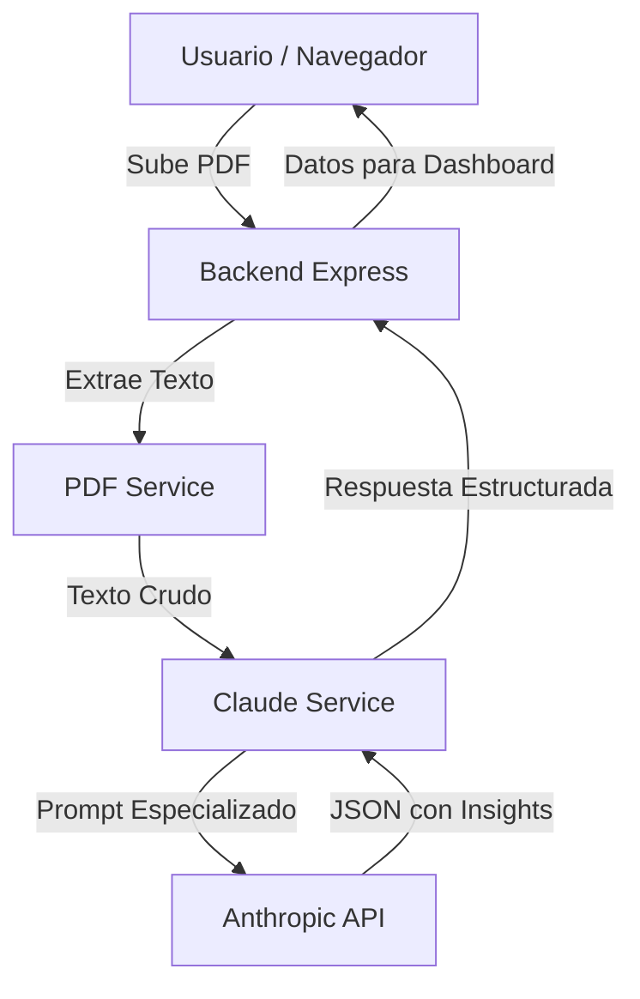

# Funcionamiento del Sistema: Agente de Optimización Logística

Este documento explica la arquitectura y el flujo de datos del chatbot diseñado para procesar reportes DDEC y Nexiq.

## 1. Arquitectura de Alto Nivel

El sistema sigue un patrón de **Arquitectura en Capas** (Services, Routes, Controller) para mantener el código modular y escalable.

---

## 2. Componentes Clave

### A. Backend (Node.js + TypeScript)
- **`index.ts`**: Punto de entrada que configura el servidor, maneja CORS, archivos estáticos y rutas.
- **`analysis.routes.ts`**: Define los puntos de acceso (endpoints). Utiliza `multer` para gestionar la carga temporal de archivos PDF.
- **`pdf.service.ts`**: Utiliza la librería `pdf-parse` para leer el contenido binario del PDF y convertirlo en texto legible para la IA.
- **`claude.service.ts`**: El "corazón" del sistema. Contiene un *System Prompt* avanzado que instruye a Claude 3.5 Sonnet sobre cómo actuar como un experto en logística.

### B. Inteligencia Artificial (Claude 3.5 Sonnet)
El sistema no solo "lee" el PDF, sino que lo **interpreta** basándose en tres pilares:
1.  **Razonamiento Racional**: Busca maximizar el ahorro.
2.  **Basado en Hechos**: Ignora intuiciones y se enfoca en métricas (Consumo, Ralentí, Velocidad).
3.  **Descubrimiento de Patrones**: Compara datos para hallar anomalías.

### C. Frontend (Premium Dashboard)
- Interfaz moderna basada en **Glassmorphism**.
- **Drag & Drop**: Facilita la carga de reportes.
- **Visualización**: Transforma el JSON complejo de la IA en tarjetas visuales fáciles de leer para un gerente.

---

## 3. Flujo de una Petición

1.  **Carga**: El usuario arrastra un reporte DDEC al dashboard.
2.  **Procesamiento**: El backend recibe el archivo, extrae el texto y lo envía a Claude.
3.  **Análisis**: Claude analiza el texto siguiendo el protocolo logístico y genera un JSON.
4.  **Entrega**: El frontend recibe el JSON y renderiza:
    - **Indicadores**: Consumo, ralentí y eventos.
    - **Recomendaciones**: Acciones concretas para ahorrar dinero.
    - **Patrones**: Ineficiencias detectadas en la flota.

---

## 4. Tecnologías Utilizadas
- **Lenguaje**: TypeScript (ESM).
- **Servidor**: Express.js.
- **IA**: Anthropic SDK (Claude 3.5 Sonnet).
- **Procesamiento PDF**: pdf-parse v2.
- **Diseño**: HTML5/CSS3 (Vanilla) con estética Glassmorphism.
